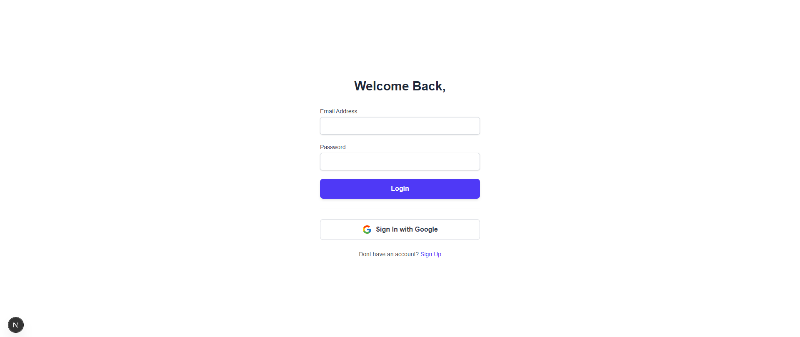
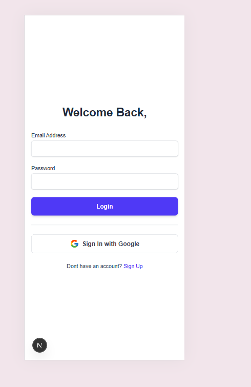
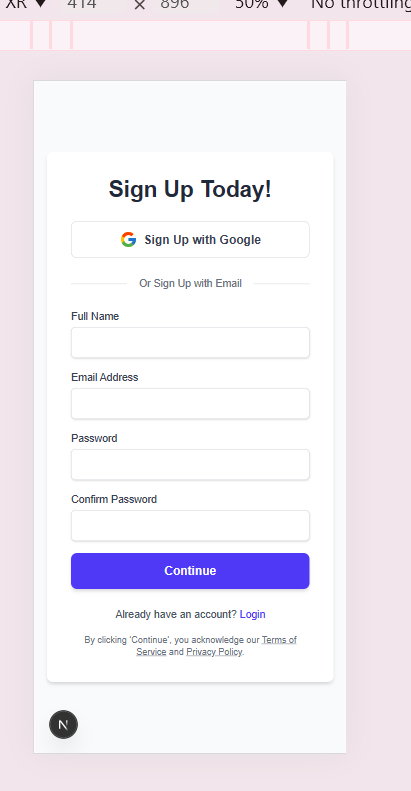
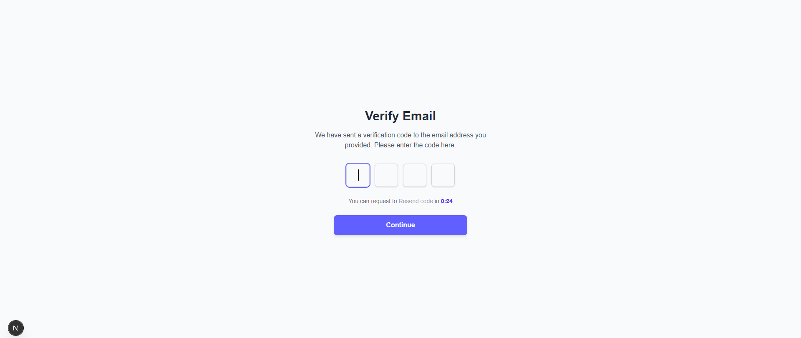
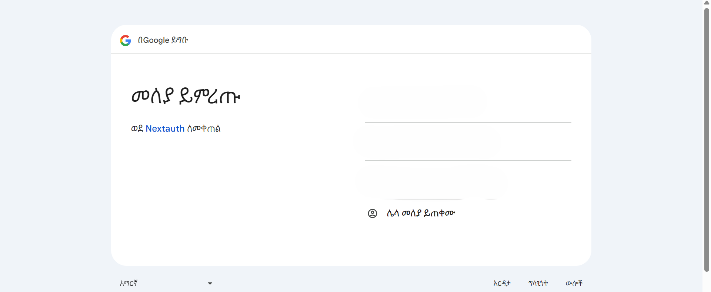

# Modern NEX-AUTH Job Board - A Full-Stack Next.js Application

This is a full-stack job board application built with Next.js, Redux Toolkit (including RTK Query), and NextAuth. It provides a complete user experience from browsing opportunities to a full authentication flow including email/password signup, Google OAuth, and email verification.

## Live Application Features

-   **Dynamic Job Listings:** Fetches and displays job opportunities from a live backend API.
-   **Full Authentication Flow:**
    -   User Signup with email, password, and client-side validation.
    -   Secure Signin with credentials and Google OAuth.
    -   Email Verification process after signup.
-   **Protected Routes:** The main job listings are only visible to authenticated users.
-   **Client-Side State Management:** Utilizes Redux Toolkit for managing auth state from next-auth and RTK Query for efficient server-state management (API data).
-   **Responsive Design:** A clean, modern UI styled with Tailwind CSS that works on all screen sizes.
-   **Error Handling:** Custom pages for application errors (500) and not-found errors (404).

## Screenshots


### Authentication Forms
*Clean, user-friendly forms for Signup, Signin, and Email Verification.*
*(Insert a composite image or individual screenshots of your auth forms here)*



### Responsive desgin



### Email verification



---

## Tech Stack

-   **Framework:** [Next.js](https://nextjs.org/) 14+ (App Router)
-   **Language:** [TypeScript](https://www.typescriptlang.org/)
-   **Authentication:** [NextAuth.js](https://next-auth.js.org/)
-   **State Management:** [Redux Toolkit](https://redux-toolkit.js.org/) & [RTK Query](https://redux-toolkit.js.org/rtk-query/overview)
-   **Styling:** [Tailwind CSS](https://tailwindcss.com/)
-   **Icons:** [React Icons](https://react-icons.github.io/react-icons/)
-   **Form Handling:** [React Hook Form](https://react-hook-form.com/) (for credential signup)

## Getting Started

Follow these instructions to get a copy of the project up and running on your local machine.

### Installation & Setup

1.  **Clone the repository**
    ```sh
    git clone https://github.com/Isru10/a2sv_task8
    cd a2sv_task8
    ```

2.  **Install dependencies**
    ```sh
    npm install
    ```

3.  **Set up environment variables**
    Create a file named `.env.local` in the root of your project and add the following variables. **This file should not be committed to Git.**

    ```sh
    NEXTAUTH_SECRET=your_super_secret_key_here
    NEXTAUTH_URL=http://localhost:3000
    GOOGLE_CLIENT_ID=your-google-client-id.apps.googleusercontent.com
    GOOGLE_CLIENT_SECRET=your-google-client-secret
    NEXT_PUBLIC_API_BASE_URL=https://akil-backend.onrender.com
    ```

4.  **Run the development server**
    ```sh
    npm run dev
    ```


